# 🦾 5-DOF Robotic Arm

> A fully self-designed 5-axis robotic arm with **76 cm reach**, cycloidal gearboxes and a custom 6-layer control board. Designed from scratch, one part at a time.

**Status: 🚧 In active development** — started August 2025, about a year of work so far. The arm moves; the electronics and structure are being upgraded to their final form.

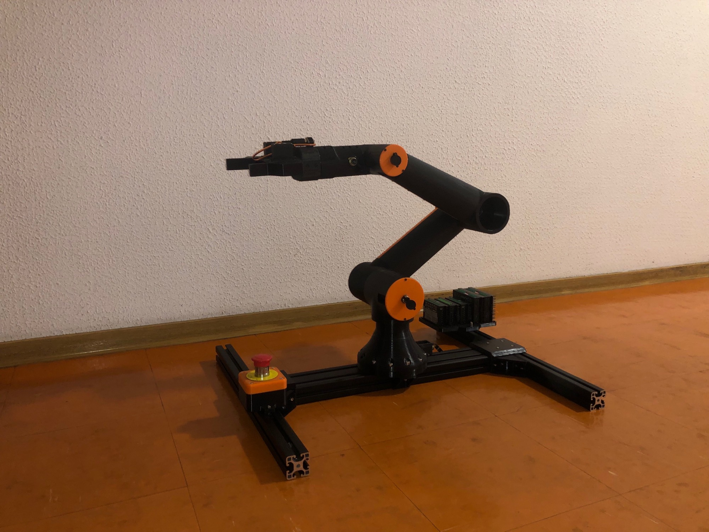

---

## 📐 Overview

| | |
|---|---|
| **Degrees of freedom** | 5 (base rotation, shoulder, elbow, wrist roll, wrist yaw) |
| **Reach** | 76 cm (without end-effector) |
| **Gearboxes** | Cycloidal drives, fully self-designed |
| **Structure** | 3D-printed links → migrating to carbon-fibre octagonal tube (50 × 46 × 2 mm) |
| **Real-time control** | Teensy 4.1 (ARM Cortex-M7) |
| **High-level control** | Raspberry Pi 5, linked by high-speed UART |
| **Power budget** | 24 V — 18 A average, 22 A peak (25 A supply for margin) |
| **CAD** | Fusion 360 |
| **Safety** | Physical emergency stop cutting the 24 V supply line |

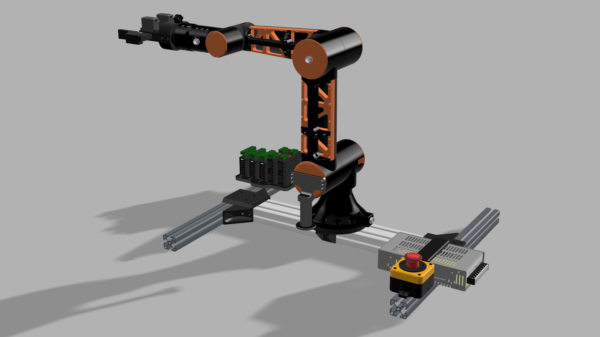

---

## ⚙️ Joints & drivetrain

Every gearbox is a **cycloidal reducer designed from scratch**. They currently run in printed polycarbonate; the final versions will be **CNC-machined in aircraft-grade aluminium**, kindly offered by **CFAI Thyez**.

| Joint | Motor | Ratio | Driver |
|---|---|---|---|
| Base / rotation | NEMA 17 — 17HE19-2004S | 1:30 | TB6600 |
| Shoulder | NEMA 23 — 23HS32-4004S | 1:40 | DM542 *(→ DM546 planned)* |
| Elbow | NEMA 23 — 23HS22-2804S | 1:40 | DM542 |
| Wrist roll | NEMA 17 — 17HE19-2004S | 1:30 | TB6600 |
| Wrist yaw | NEMA 17 — 17HE19-2004S | 1:30 | TB6600 |

> The shoulder's DM542 currently limits that motor to ~70 % of its rated torque. Moving to a DM546 unlocks the full 100 %.

  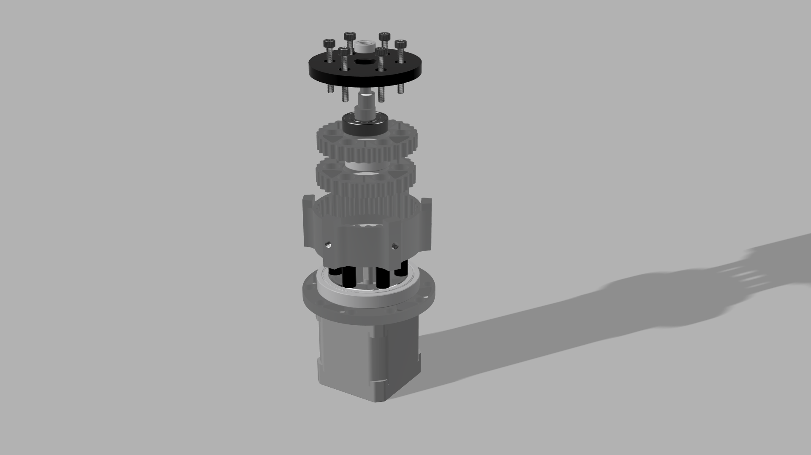
  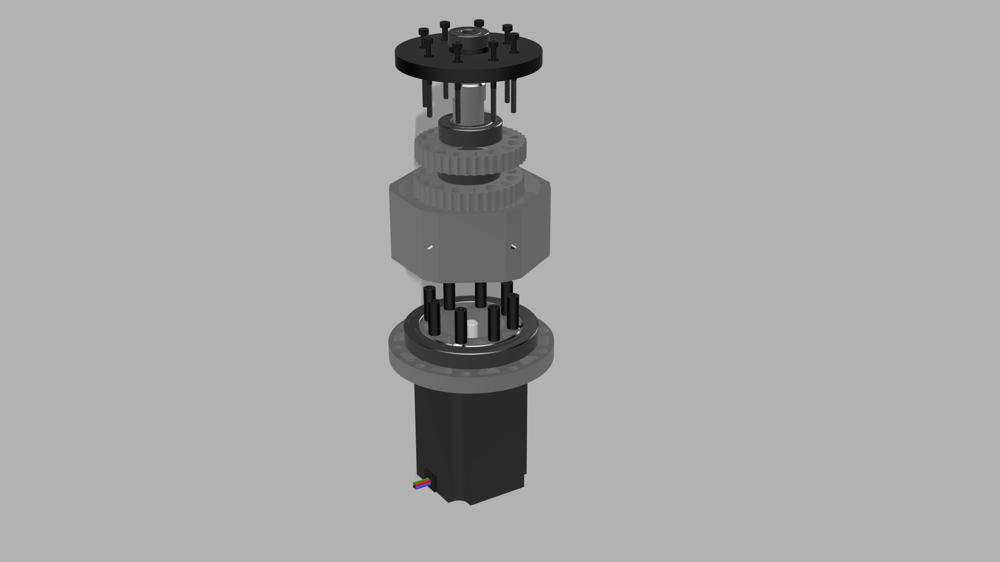

<i>Exploded views — NEMA 17 (1:30) and NEMA 23 (1:40) cycloidal gearboxes</i>

### 💥 Destructive testing

Payload can't be properly measured until the arm is finished — so instead I tested the drivetrain to failure. The shoulder assembly (NEMA 23 + 1:40 cycloidal gearbox) reached **46 Nm of output torque before the printed gearbox broke.**

That number is a floor, not a ceiling: it's the limit of the *printed* version. The machined aluminium gearboxes should go well beyond it.

---

## 🧠 Control architecture

The system splits work between two brains:

- **Raspberry Pi 5** — heavy lifting: inverse kinematics, trajectory planning, user interface. Sends motion instructions down to the Teensy.
- **Teensy 4.1 (Cortex-M7)** — hard real-time: step generation, driver control, and streaming position, current and temperature data back up to the Pi.

They talk over a **high-speed UART link**, protected by a `PESD3V3L2BT` TVS diode. The Pi is powered directly from the control board through a dedicated USB port.

Inverse kinematics will be handled with existing Python libraries first, with the option of implementing them from scratch or simulating the arm in **NVIDIA Isaac Sim**.

### 🔄 Closed-loop control

AS5600 encoders on every axis serve two purposes:

- **Step-loss correction** — the controller knows the real joint angle, not just how many steps it *thinks* it sent.
- **Teach & repeat** — the feature I'm building toward: physically move the arm into a position, record it, then replay the whole sequence with configurable delays, pauses and loop counts.

### 🎯 Calibration

Each joint carries **alignment holes** that line up in a known position, where a metal pin is inserted to lock the axis precisely. That defines the absolute zero of the encoders.

The encoders sit on the motor side of the gearboxes, so each joint revolution turns the encoder 30 or 40 times. That multiplies effective angular resolution — 12 bits × 40 works out to roughly 0.002° per count on the geared joints — but it also means absolute position is lost at power-off: the controller knows the angle *within* an encoder turn, not which of the 40 turns it's on.

So the arm is re-mastered at every startup. This is exactly how industrial robots handle it — and it's far more precise than relying on limit switches.

---

## 🔌 Custom control board

A **6-layer PCB**, designed entirely in KiCad, handling power, sensing and motor control for the whole arm.

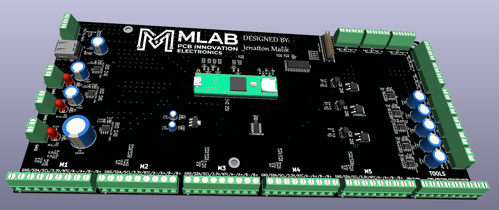

**Sensing**
- **Position** — AS5600 12-bit magnetic encoders on every axis, over I²C, mounted **before the reduction stage**
- **Temperature** — an NTC-MF52-103 thermistor on each motor
- **Current** — ACS712 20 A on each power rail (5 V / 12 V / 24 V), plus an ACS712 5 A monitoring the 24 V feed of *every individual driver*

**I/O expansion**
- `TCA9548A` I²C multiplexer, so all five AS5600 encoders can share the bus despite having the same fixed address
- `MCP23017` GPIO expander driving STEP, the power MOSFETs, and DIR
- DIR lines are routed through **0 Ω jumper resistors**, so each axis can be driven either directly by the Teensy or through the expander — a deliberate choice to keep options open during bring-up

**Tool interface**
A connector runs from the board to the end of the arm, carrying **5 V, 12 V and 24 V** — each individually switchable through P-channel MOSFETs, so the ground is never broken — plus a **UART line** and **2 PWM channels**, ready for whatever end-effector comes next.

**Design detail:** the AS5600 I²C pull-ups are 10 kΩ and 2.2 kΩ in parallel, giving ≈ 1.8 kΩ — strong enough to keep clean edges on a long, noisy bus.

  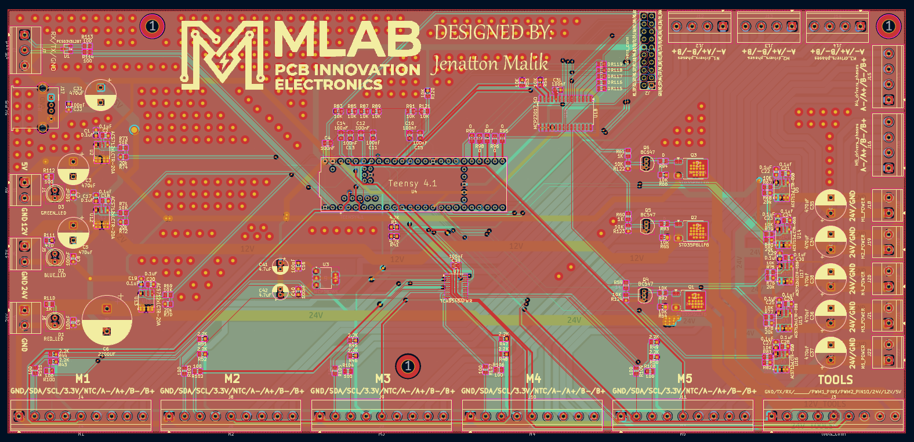
  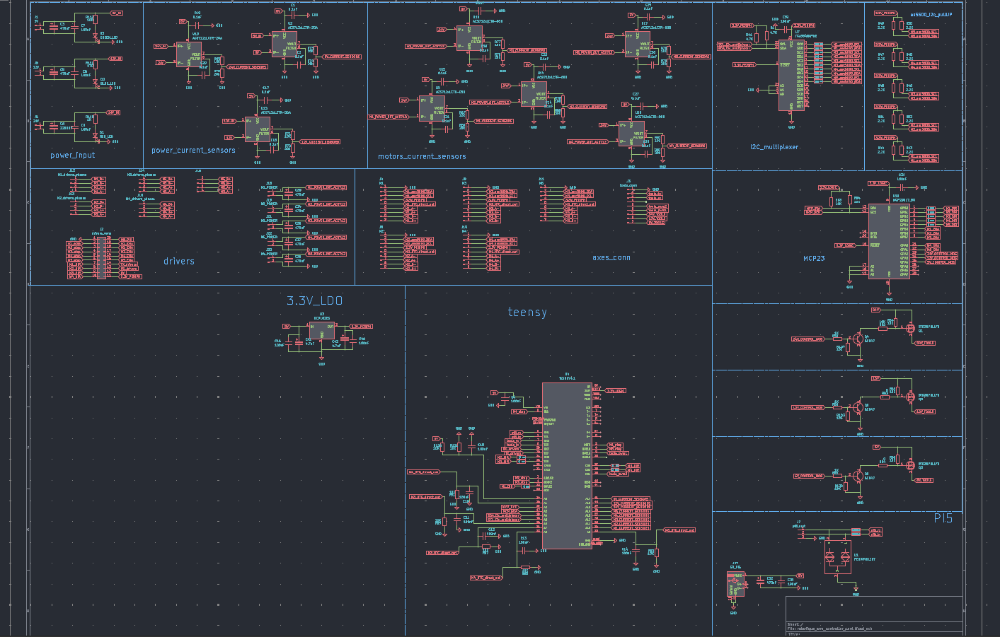

<i>6-layer routing and full schematic — KiCad</i>

### 🧪 I²C stress test — validating the encoder bus

Long I²C lines running alongside stepper phases are a classic recipe for corrupted data, so before committing to the design I built the **worst case I could imagine** and tried to break it.

**The setup:** 1.3 m of encoder cable, deliberately wrapped around the cable of a stepper motor running at full speed.

**Measured on three independent fronts:**
- **Oscilloscope** — signal integrity: rise times, edge shape, noise coupled onto SDA/SCL
- **Logic analyser** — protocol level: watching for NACKs and framing errors
- **Serial monitor** — data level: checking for incoherent or jumping angle values

**Result:** the bus held. This validated both the **1.8 kΩ pull-ups at 3.3 V** and the choice to run the bus at **50 kHz** — slow by I²C standards, but a deliberate trade: bandwidth I don't need, in exchange for noise margin I very much do.

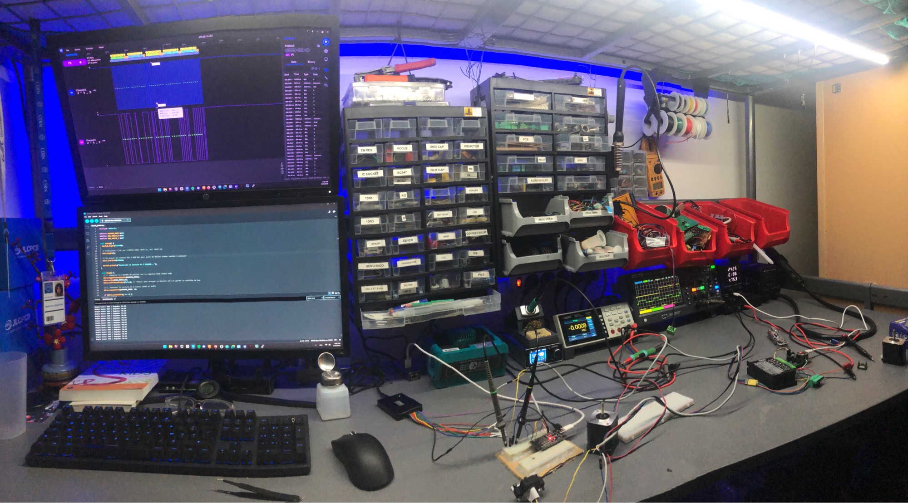

---

## 🔗 Wiring

Each joint uses a **GX16 connector**, so motor phases, encoder and thermistor can be plugged and unplugged cleanly.

- **Signals** — shielded TRVVSP high-flexibility cable, chosen to survive continuous motion
- **Motor phases** — 4 × AWG16 silicone wire

One cable runs out of each axis. Not the tidiest routing in the world — but with stepper motors and this joint architecture, there's no way around it.

---

## 📊 Current state

**What works**
- All five cycloidal gearboxes are assembled and driving the arm
- The mechanical structure is complete and the arm is technically usable
- Motion currently runs on prototype electronics — **one axis at a time**, until the control board is built

  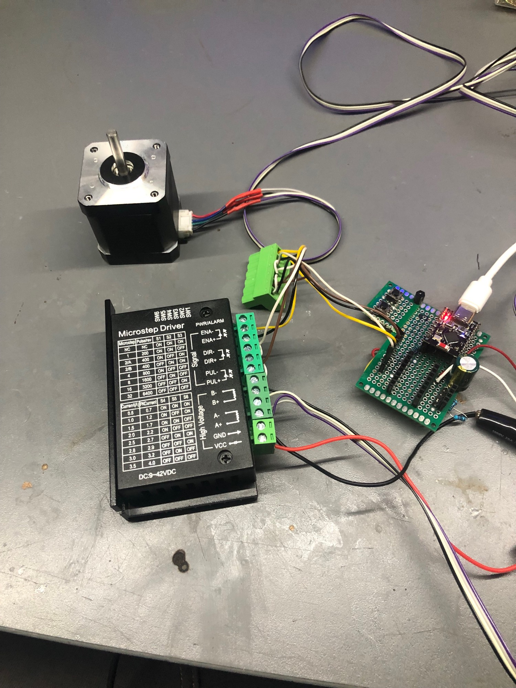
  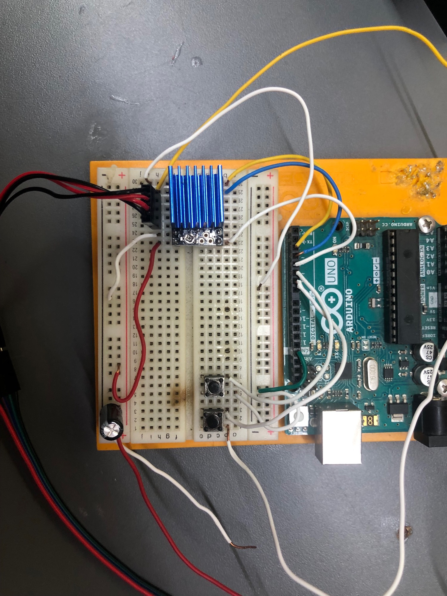

<i>Current prototype electronics — one axis at a time</i>

**Known limitations (and why)**
- **Backlash** in the printed gearboxes — I've done everything I can to minimise it, but FDM has hard limits. Solved by the aluminium versions.
- **Flex / wobble** in the 3D-printed links — clearly visible in the video below, and exactly why the carbon-fibre tubes are next on the list.

Being honest about this matters more to me than pretending it's finished. Every limitation here already has an engineered answer waiting to be built.

*(drop your arm-in-motion video right here)*

---

## 📈 Evolution

The arm has been through a lot of iterations since August 2025. A few snapshots along the way:

  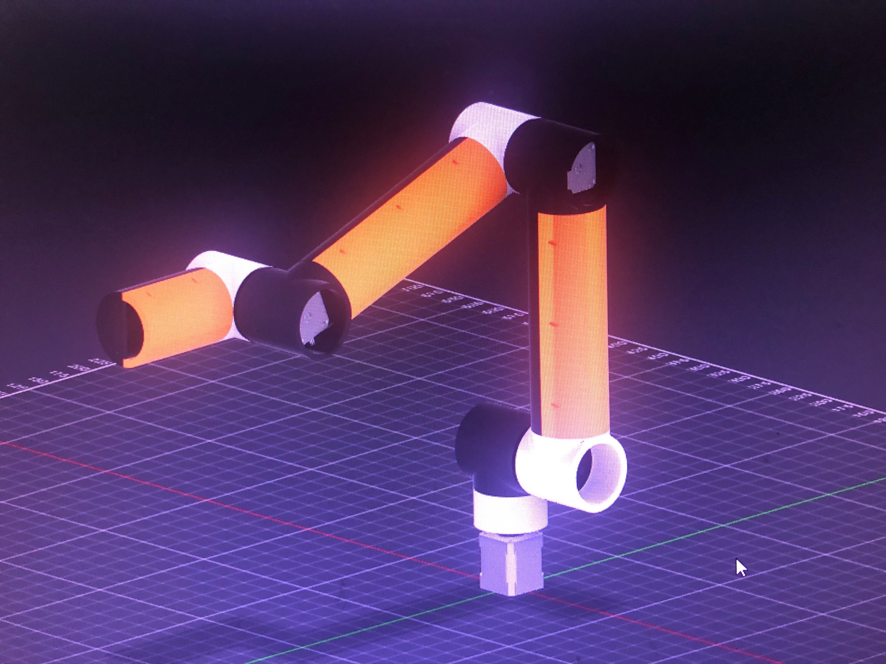
  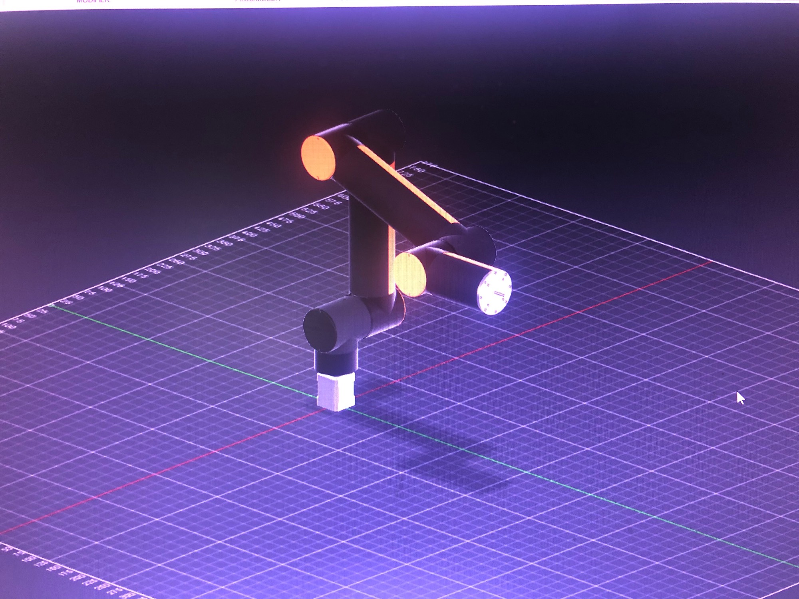
  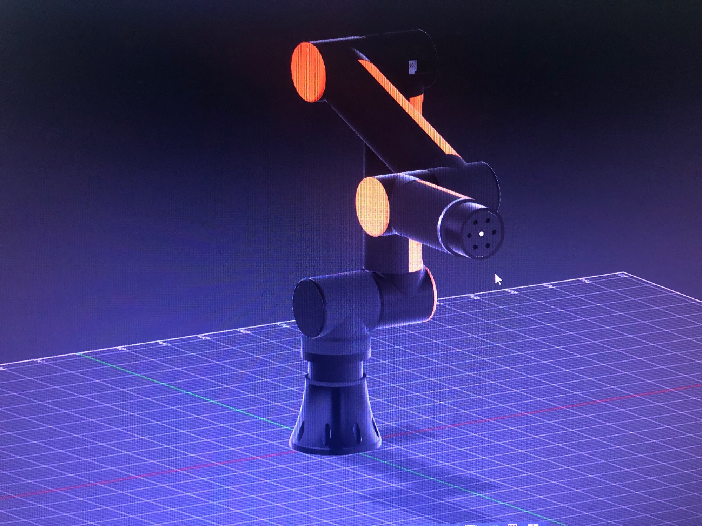

<i>20 Aug 2025 · 22 Aug 2025 · 11 Sep 2025</i>

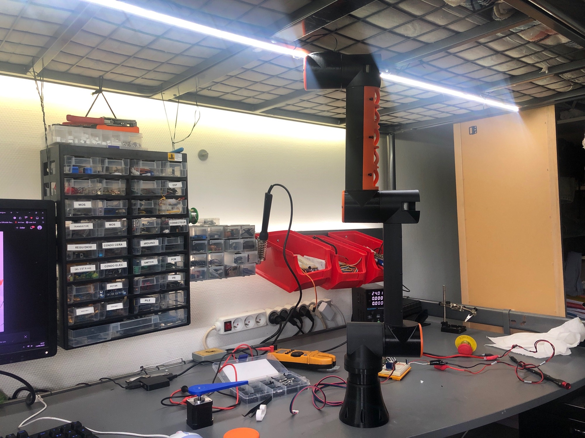

<i>13 Sep 2025 — the first version to exist outside a screen</i>

*(drop your first cycloidal gearbox prototype video here — where the whole mechanical side of this project started)*

---

## 🗺️ Roadmap

- [ ] Manufacture the 6-layer control board and populate it
- [ ] Machine the cycloidal gearboxes in aircraft-grade aluminium *(CFAI Thyez)*
- [ ] Replace printed links with carbon-fibre octagonal tubes
- [ ] Upgrade the shoulder driver to a DM546
- [ ] Add the 24 V / 25 A supply and the 12 V & 5 V step-down converters
- [ ] Switch from prototype electronics to full 5-axis simultaneous control
- [ ] Implement inverse kinematics and the teach & repeat system
- [ ] Finish the touchscreen operator interface on the Pi 5

---

## 🤝 Supporting this project

This arm is entirely self-funded, and hardware at this scale gets expensive fast. Remaining items needed to complete it:

| Item | Purpose |
|---|---|
| PCB manufacturing + components | The 6-layer control board |
| 24 V / 25 A power supply | Main arm supply |
| 12 V & 5 V step-down converters (10 A) | Logic and auxiliary rails |
| DM546 driver | Full torque on the shoulder axis |
| GX16 9-pin connectors | Correct pin count for all joint signals |
| Raspberry Pi touchscreen | Operator interface |

If you're a company interested in supporting a young engineer building this in the open, I'd love to talk.

---

## 🛠️ Built with

`Fusion 360` · `KiCad` · `Teensy 4.1 / Cortex-M7` · `Raspberry Pi 5` · `Python` · `Embedded C++` · `FDM 3D printing` · `CNC machining (partner)`

---

## 📜 License

**© 2026 Malik Jenatton — All rights reserved.**

This project is shared publicly for documentation and demonstration purposes. No permission is granted to reproduce, distribute, manufacture or create derivative works from these designs.

I'm a strong believer in open source, and I fully intend to release this project under an open hardware licence — but only once it's finished and I've had time to choose the right one. Until then, all rights are reserved.

If you'd like to use anything here, just ask — I'm open to it.
